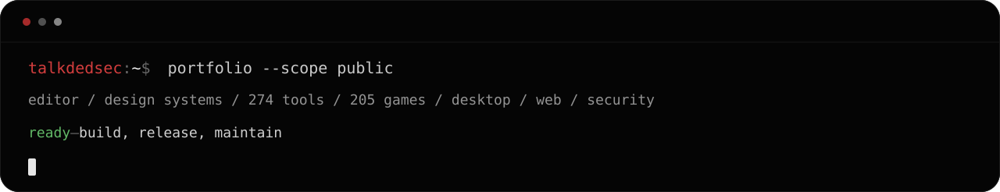

<p align="center">
  
</p>

<p align="center">
  <a href="https://talkdedsec.com"><b>Website</b></a>
  &nbsp;&nbsp;·&nbsp;&nbsp;
  <a href="https://code.talkdedsec.com"><b>Talkdedsec Editor</b></a>
  &nbsp;&nbsp;·&nbsp;&nbsp;
  <a href="https://github.com/talkdedseccode"><b>Product GitHub</b></a>
</p>

<p align="center">
  <sub>Currently using <code>Talkdedsec1</code> while the original username is being released.</sub>
</p>


<table>
<tr>
<td width="30%" align="center" valign="middle">



</td>
<td width="70%" valign="middle">

## I build software that has a reason to exist.

Desktop applications, developer tools, web products, internal systems and the occasional experiment that grows into something larger.

Most of my work starts small and stays focused. I care about the parts people notice after the first five minutes: **speed, clear states, predictable behaviour and a clean failure path**.

I am not interested in collecting frameworks or publishing empty demos. A project is finished when it works outside the screenshot.

</td>
</tr>
</table>

<br>




## What I work on

<table>
<tr>
<td width="50%" valign="top">

### Product software

Tools and applications built around a specific workflow rather than a generic feature list.

- Windows desktop applications
- Developer tooling
- Workflow automation
- Product-focused web applications

</td>
<td width="50%" valign="top">

### Systems and delivery

The less visible work that determines whether a product remains useful after launch.

- Deployment and release flows
- Service integration
- Operational tooling
- Performance and reliability work

</td>
</tr>
</table>

<br>

### Working with

<p>
  <kbd>TypeScript</kbd>
  <kbd>JavaScript</kbd>
  <kbd>React</kbd>
  <kbd>Next.js</kbd>
  <kbd>Node.js</kbd>
  <kbd>Tauri</kbd>
  <kbd>Rust</kbd>
  <kbd>Go</kbd>
  <kbd>C#</kbd>
  <kbd>Python</kbd>
  <kbd>PowerShell</kbd>
  <kbd>Linux</kbd>
</p>


## Selected work

<table>
<tr>
<td width="68%" valign="top">

### Talkdedsec Editor

A focused Windows code editor with its own release, documentation and theme ecosystem.

The editor is maintained through the dedicated [`talkdedseccode`](https://github.com/talkdedseccode) project account so product releases and personal work remain clearly separated.

<p>
  <a href="https://code.talkdedsec.com"><b>Product site →</b></a>
  &nbsp;&nbsp;·&nbsp;&nbsp;
  <a href="https://github.com/talkdedseccode/talkdedsec-editor/releases/latest"><b>Latest release →</b></a>
  &nbsp;&nbsp;·&nbsp;&nbsp;
  <a href="https://github.com/talkdedseccode/talkdedsec-themes"><b>Themes →</b></a>
</p>

</td>
<td width="32%" valign="middle" align="center">

```text
WINDOWS x64
DESKTOP SOFTWARE
ACTIVE PRODUCT
```

</td>
</tr>
</table>


## How I approach a project

<table>
<tr>
<td width="25%" align="center" valign="top">

### 01

**Find the actual problem**

Start with the workflow, not the feature list.

</td>
<td width="25%" align="center" valign="top">

### 02

**Remove weak assumptions**

Prototype the risky parts before polishing the safe ones.

</td>
<td width="25%" align="center" valign="top">

### 03

**Make failure visible**

Errors should explain what happened and leave a recovery path.

</td>
<td width="25%" align="center" valign="top">

### 04

**Ship the complete path**

Build, installation, updates and maintenance are part of the product.

</td>
</tr>
</table>

<br>

```text
clarity over noise
working software over presentation
measured results over assumptions
small dependable parts over fragile complexity
```


## Find me

The main home for published work, product pages and future releases is **[talkdedsec.com](https://talkdedsec.com)**.

For Talkdedsec Editor releases, documentation and support, use **[code.talkdedsec.com](https://code.talkdedsec.com)**.

<br>

<p align="center">
  
</p>

<p align="center">
  <sub>Built under the Talkdedsec name.</sub>
</p>
