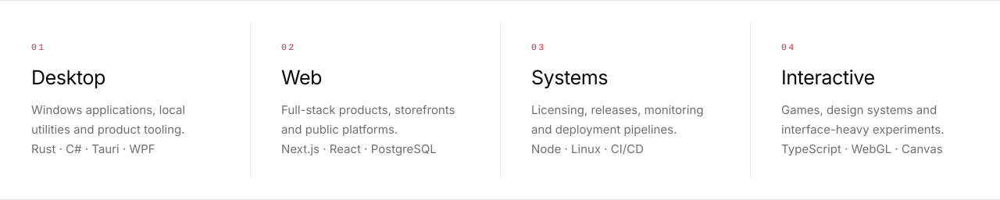
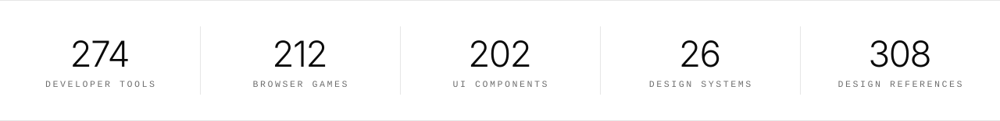

<picture>
  <source media="(prefers-color-scheme: dark)" srcset="assets/hero-dark.svg">
  <source media="(prefers-color-scheme: light)" srcset="assets/hero-light.svg">
  
</picture>

  <a href="https://talkdedsec.com/en">Site</a>
  &nbsp;·&nbsp;
  <a href="https://code.talkdedsec.com">Editor</a>
  &nbsp;·&nbsp;
  <a href="https://styles.talkdedsec.com/en">Styles</a>
  &nbsp;·&nbsp;
  <a href="https://agents.talkdedsec.com">Agents</a>
  &nbsp;·&nbsp;
  <a href="https://talkdedsec.com/tools">Tools</a>
  &nbsp;·&nbsp;
  <a href="https://talkdedsec.com/games">Games</a>
  &nbsp;·&nbsp;
  <a href="https://talkdedsec.com/writeups">Writeups</a>
  &nbsp;·&nbsp;
  <a href="PROJECTS.md">Projects</a>
  &nbsp;&nbsp;|&nbsp;&nbsp;
  <a href="README.tr.md"><b>Türkçe</b></a>

<table>
<tr>
<td width="30%" align="center" valign="middle">
  
</td>
<td width="70%" valign="middle">

### Talkdedsec

I run a small studio. Everything on this account is my own work: a Windows code editor, a design-system library, a catalogue of browser tools and games, an AI agent archive, a FiveM script store, and the licensing and deployment layer that keeps them running.

Most of it ships as a product, not a demo. That means installers, update channels, licence checks and a support inbox. Nothing collects telemetry and nothing is funded by a sponsor.

</td>
</tr>
</table>

<picture>
  <source media="(prefers-color-scheme: dark)" srcset="assets/pillars-dark.svg">
  <source media="(prefers-color-scheme: light)" srcset="assets/pillars-light.svg">
  
</picture>

<picture>
  <source media="(prefers-color-scheme: dark)" srcset="assets/metrics-dark.svg">
  <source media="(prefers-color-scheme: light)" srcset="assets/metrics-light.svg">
  
</picture>

## Sites

| | What it is |
|:--|:--|
| **[talkdedsec.com](https://talkdedsec.com/en)** | Studio site. Tools, games, portfolio, notes and CTF writeups. Turkish and English. |
| **[code.talkdedsec.com](https://code.talkdedsec.com)** | Talkdedsec Editor. A Windows editor built on an open-source core, with the telemetry layer removed at the source. |
| **[styles.talkdedsec.com](https://styles.talkdedsec.com/en)** | 26 design systems compiled from one TypeScript source into DESIGN.md, Tailwind v4, CSS variables and design tokens. 202 components, 130 themes, 308 references. |
| **[agents.talkdedsec.com](https://agents.talkdedsec.com)** | AI agent definitions, 54 Claude Code skills, system prompts, MCP server guides and multi-agent workflow templates. |
| **[projects.talkdedsec.com](https://projects.talkdedsec.com)** | Portfolio in a desktop-OS interface: security tools, FiveM scripts, CLI and desktop apps. |
| **[store.talkdedsec.com](https://store.talkdedsec.com)** | FiveM scripts. Server-authoritative, resmon-friendly, delivered through Tebex. |
| **[ornek.talkdedsec.com](https://ornek.talkdedsec.com)** | Live demos of the site templates I sell. |
| **[flypen.com.tr](https://flypen.com.tr)** | Production platform I build and operate. |

## Browser catalogue

<table>
<tr>
<td width="50%" valign="top">

### [274 developer tools](https://talkdedsec.com/tools)

Hashing, base64, JWT, regex, subnet maths, encoding, text processing, data formats. Everything runs in the browser. Nothing is uploaded, nothing is logged.

</td>
<td width="50%" valign="top">

### [212 games](https://talkdedsec.com/games)

Puzzle, strategy, reflex, memory and word games, plus larger terminal and sandbox titles. All client-side, no accounts.

</td>
</tr>
</table>

## Desktop applications

| | Description | Stack |
|:--|:--|:--|
| **Talkdedsec Editor** | Windows code editor. Own release channel, themes, docs and support flow. | TypeScript / Node |
| **Talkdedsec Visual** | Real-time screen colour engine for Windows. Brightness, contrast, saturation, hue and night vision through a 5×5 colour matrix. No runtime dependencies. | Rust / Slint |
| **TLK Player** | Local music widget with seven themes and a bit-perfect audio chain. | Rust / Tauri |
| **Talkdedsec Browser** | Windows browser, shipped in a WebView2 build and a Chromium (CEF) build. | C# / WPF |
| **DedSec Control Center** | Windows tweak and cleanup suite with a licence model. | C# / .NET |
| **TLK Cleaner** | Disk, cache and leftover-file cleanup. | C# |

## Open source

<!-- OSS:START -->
Nothing public yet. Repositories are opened one at a time.

Synced 12 Aug 2026 · public repositories only
<!-- OSS:END -->

<a href="PROJECTS.md"><b>Full project index →</b></a>

## Stack

| | |
|:--|:--|
| **Languages** | TypeScript · JavaScript · Rust · C# · Go · Python · Lua · PowerShell · SQL |
| **Application** | Next.js · React · Node.js · Tauri · WPF · WebView2 · Slint |
| **Data & platform** | PostgreSQL · Prisma · Redis · Linux · nginx · PM2 · systemd |
| **Delivery** | GitHub Actions · Playwright · Sentry · Tebex · licence server · auto-update |

## Contact

| | |
|:--|:--|
| Email | [talkdedsec@proton.me](mailto:talkdedsec@proton.me) |
| Contact page | [talkdedsec.com/contact](https://talkdedsec.com/contact) |
| Editor releases | [github.com/talkdedseccode](https://github.com/talkdedseccode) |
| Notes and writeups | [talkdedsec.com/blog](https://talkdedsec.com/blog) · [talkdedsec.com/writeups](https://talkdedsec.com/writeups) |

 

  

  Main account for work published under the Talkdedsec name.

