<p align="center">
  
</p>

<p align="center">
  <a href="https://talkdedsec.com"><b>Website ↗</b></a>
  &nbsp;&nbsp;·&nbsp;&nbsp;
  <a href="https://code.talkdedsec.com"><b>Editor ↗</b></a>
  &nbsp;&nbsp;·&nbsp;&nbsp;
  <a href="https://styles.talkdedsec.com/en"><b>Styles ↗</b></a>
  &nbsp;&nbsp;·&nbsp;&nbsp;
  <a href="https://talkdedsec.com/tools"><b>Tools ↗</b></a>
  &nbsp;&nbsp;·&nbsp;&nbsp;
  <a href="https://talkdedsec.com/games"><b>Games ↗</b></a>
  &nbsp;&nbsp;·&nbsp;&nbsp;
  <a href="PROJECTS.md"><b>Project index</b></a>
</p>


<table>
<tr>
<td width="34%" align="center" valign="middle">


</td>
<td width="66%" valign="middle">

## Talkdedsec

This is the primary GitHub account for my personal work and public portfolio.

I build and maintain desktop applications, developer tools, web products, security utilities and browser games. Product-specific releases for Talkdedsec Editor live under the separate [`talkdedseccode`](https://github.com/talkdedseccode) account.

The work is grouped by product, not by language. A repository can start as a small utility and grow into a complete application, service or platform.

</td>
</tr>
</table>

<br>


<br>




## Main products

<table>
<tr>
<td width="50%" valign="top">

### [Talkdedsec Editor ↗](https://code.talkdedsec.com)

Windows code editor with its own releases, documentation, themes and support flow.

`Windows` `Desktop` `Developer tooling`

</td>
<td width="50%" valign="top">

### [talkdedsec styles ↗](https://styles.talkdedsec.com/en)

Design systems and working React components for consistent product interfaces and agent-driven development.

`TypeScript` `React` `Design systems`

</td>
</tr>
<tr>
<td width="50%" valign="top">

### [Developer tools ↗](https://talkdedsec.com/tools)

A browser-based collection covering cryptography, encoding, text, web, networking, data formats and development workflows.

`274 tools` `Browser` `Utilities`

</td>
<td width="50%" valign="top">

### [Games ↗](https://talkdedsec.com/games)

A browser game collection spanning puzzles, strategy, reflex, memory, word games and larger terminal/sandbox titles.

`205 games` `Browser` `Interactive`

</td>
</tr>
</table>


## Web platforms

<table>
<tr>
<td width="33%" valign="top">

### [rixor.tr ↗](https://rixor.tr)

FiveM-oriented desktop and web product ecosystem.

`Next.js` `React` `Desktop integration`

</td>
<td width="33%" valign="top">

### [rixor.com.tr ↗](https://rixor.com.tr)

Multilingual e-commerce platform with a full administration layer.

`Next.js` `PostgreSQL` `E-commerce`

</td>
<td width="33%" valign="top">

### [flypen.com.tr ↗](https://flypen.com.tr)

Production web platform built around deployment, observability and operational continuity.

`Next.js` `CI/CD` `Operations`

</td>
</tr>
</table>


## Public software portfolio

<table>
<tr>
<td width="50%" valign="top">

### Security and systems

- **SentinelAI** — security and monitoring for AI-agent workflows
- **ghostkey** — secret scanning with false-positive reduction
- **ShieldX** — reversible Windows security and privacy controls
- **ipspy** — passive IP and domain intelligence
- **portx** — lightweight Go port scanner
- **checksum** — file hashing and reputation checks

</td>
<td width="50%" valign="top">

### Local and productivity tools

- **tweakforge** — Windows tweak and cleanup utility
- **encodex** — multi-format encoder and decoder
- **vaultpass** — password generation and exposure checking
- **vaultx** — encrypted notes
- **taskforge** — browser-local Kanban workspace

</td>
</tr>
</table>

<p align="center">
  <a href="PROJECTS.md"><b>Open the full public project index →</b></a>
</p>


## Working areas

<table>
<tr>
<td width="25%" align="center" valign="top">

### 01

**Desktop**

Windows applications, local utilities and product tooling.

</td>
<td width="25%" align="center" valign="top">

### 02

**Web**

Full-stack products, dashboards and public platforms.

</td>
<td width="25%" align="center" valign="top">

### 03

**Systems**

Automation, release flows, monitoring and operations.

</td>
<td width="25%" align="center" valign="top">

### 04

**Interactive**

Games, design systems and interface-heavy experiments.

</td>
</tr>
</table>

<br>

### Stack

<p>
  <kbd>TypeScript</kbd>
  <kbd>JavaScript</kbd>
  <kbd>React</kbd>
  <kbd>Next.js</kbd>
  <kbd>Node.js</kbd>
  <kbd>Go</kbd>
  <kbd>Rust</kbd>
  <kbd>Tauri</kbd>
  <kbd>C#</kbd>
  <kbd>Python</kbd>
  <kbd>PowerShell</kbd>
  <kbd>PostgreSQL</kbd>
  <kbd>Linux</kbd>
</p>


## Project approach

```text
understand the workflow
prototype the risky parts
make failure visible
finish the delivery path
measure the result
```

A project is not finished when its main screen works. Packaging, updates, recovery, documentation and maintenance are part of the product.


## Links

| Area | Destination |
|:--|:--|
| Main website | [talkdedsec.com ↗](https://talkdedsec.com) |
| Code editor | [code.talkdedsec.com ↗](https://code.talkdedsec.com) |
| Design systems and components | [styles.talkdedsec.com ↗](https://styles.talkdedsec.com/en) |
| Developer tools | [talkdedsec.com/tools ↗](https://talkdedsec.com/tools) |
| Browser games | [talkdedsec.com/games ↗](https://talkdedsec.com/games) |
| Editor project account | [github.com/talkdedseccode ↗](https://github.com/talkdedseccode) |

<br>

<p align="center">
  
</p>

<p align="center">
  <sub>Primary account for work published under the Talkdedsec name.</sub>
</p>
