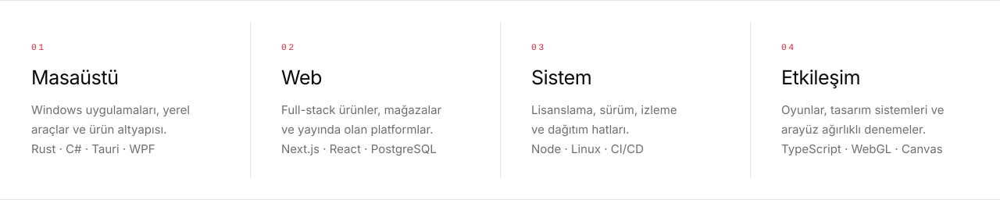
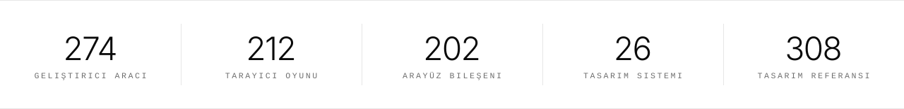

<picture>
  <source media="(prefers-color-scheme: dark)" srcset="assets/hero-tr-dark.svg">
  <source media="(prefers-color-scheme: light)" srcset="assets/hero-tr-light.svg">
  
</picture>

<p align="center">
  <a href="https://talkdedsec.com">Site</a>
  &nbsp;·&nbsp;
  <a href="https://code.talkdedsec.com">Editör</a>
  &nbsp;·&nbsp;
  <a href="https://styles.talkdedsec.com">Styles</a>
  &nbsp;·&nbsp;
  <a href="https://talkdedsec.com/tools">Araçlar</a>
  &nbsp;·&nbsp;
  <a href="https://talkdedsec.com/games">Oyunlar</a>
  &nbsp;·&nbsp;
  <a href="PROJECTS.md">Proje dizini</a>
  &nbsp;&nbsp;|&nbsp;&nbsp;
  <a href="README.md"><b>English</b></a>
</p>


<table>
<tr>
<td width="30%" align="center" valign="middle">
  
</td>
<td width="70%" valign="middle">

### Gerçekten kullanılan yazılımlar üreten bağımsız bir stüdyo

Talkdedsec kendi ürünlerini tasarlar, geliştirir ve sürdürür: bir Windows kod editörü, bileşen ve tasarım sistemi kütüphanesi, tarayıcıda çalışan araç ve oyun kataloğu, ticari web platformları ve bunların arkasındaki lisans ile sürüm altyapısı.

İşler dile göre değil ürüne göre düzenlenir. Bir depo küçük bir yardımcı araç olarak başlayıp kurulumu, güncellemesi, telemetrisi ve destek akışı olan bir uygulamaya dönüşebilir. Buradaki her şey gösterilmek için değil, teslim edilmek için yapılır.

</td>
</tr>
</table>


<picture>
  <source media="(prefers-color-scheme: dark)" srcset="assets/pillars-tr-dark.svg">
  <source media="(prefers-color-scheme: light)" srcset="assets/pillars-tr-light.svg">
  
</picture>

<picture>
  <source media="(prefers-color-scheme: dark)" srcset="assets/metrics-tr-dark.svg">
  <source media="(prefers-color-scheme: light)" srcset="assets/metrics-tr-light.svg">
  
</picture>


## Ürünler

<table>
<tr>
<td width="50%" valign="top">

### [Talkdedsec Editör](https://code.talkdedsec.com)

Kendi sürüm kanalı, temaları, dokümantasyonu ve destek akışı olan bir Windows kod editörü. Entegre güncelleme yolu bulunan bir kurulum paketi olarak dağıtılır.

<sub>`Windows` · `Masaüstü` · `Geliştirici aracı`</sub>

</td>
<td width="50%" valign="top">

### [talkdedsec styles](https://styles.talkdedsec.com)

Tutarlı arayüzler için tasarım sistemleri ve üretime hazır React bileşenleri — hem insanların hem kod yazan ajanların kullanabileceği biçimde.

<sub>`TypeScript` · `React` · `Tasarım sistemi`</sub>

</td>
</tr>
<tr>
<td width="50%" valign="top">

### [Geliştirici araçları](https://talkdedsec.com/tools)

Kriptografi, kodlama, metin işleme, ağ, veri biçimleri ve günlük geliştirme akışlarını kapsayan, tarayıcıda çalışan bir koleksiyon.

<sub>`274 araç` · `Tarayıcı` · `Kurulum yok`</sub>

</td>
<td width="50%" valign="top">

### [Oyunlar](https://talkdedsec.com/games)

Bulmaca, strateji, refleks, hafıza ve kelime oyunlarının yanında daha büyük terminal ve sandbox yapımları — tamamı istemci tarafında.

<sub>`205 oyun` · `Tarayıcı` · `Canvas / WebGL`</sub>

</td>
</tr>
</table>


## Yayındaki platformlar

<table>
<tr>
<td width="33%" valign="top">

### [rixor.tr](https://rixor.tr)

Kendi istemci uygulaması ve hesap katmanı olan masaüstü + web ürün ekosistemi.

<sub>`Next.js` · `React` · `Masaüstü entegrasyonu`</sub>

</td>
<td width="33%" valign="top">

### [rixor.com.tr](https://rixor.com.tr)

Tam yönetim katmanı, ödeme akışı ve 3B vitrini olan çok dilli e-ticaret.

<sub>`Next.js` · `Prisma` · `PostgreSQL`</sub>

</td>
<td width="33%" valign="top">

### [flypen.com.tr](https://flypen.com.tr)

Uçtan uca sürdürülen bir üretim platformu: dağıtım, izleme ve operasyonel süreklilik.

<sub>`Next.js` · `PM2` · `CI/CD`</sub>

</td>
</tr>
</table>


## Açık kaynak

<!-- OSS:START -->
Henüz açık kaynak depo yok — katalog ürün ürün yayınlanıyor.

<sub>12 Ağu 2026 tarihinde eşitlendi · yalnızca açık depolar</sub>
<!-- OSS:END -->

<p align="right"><a href="PROJECTS.md"><b>Tüm proje dizini →</b></a></p>


## Teknoloji

<table>
<tr>
<td width="25%" valign="top"><sub><b>DİLLER</b></sub><br><br>

`TypeScript` `JavaScript` `Rust` `C#` `Go` `Python` `Lua` `PowerShell` `SQL`

</td>
<td width="25%" valign="top"><sub><b>UYGULAMA</b></sub><br><br>

`Next.js` `React` `Node.js` `Tauri` `WPF` `WebView2` `Electron` `Slint`

</td>
<td width="25%" valign="top"><sub><b>VERİ & PLATFORM</b></sub><br><br>

`PostgreSQL` `Prisma` `Redis` `Linux` `nginx` `PM2` `systemd`

</td>
<td width="25%" valign="top"><sub><b>TESLİMAT</b></sub><br><br>

`GitHub Actions` `Playwright` `Sentry` `Lisanslama` `Otomatik güncelleme`

</td>
</tr>
</table>


## Stüdyo nasıl çalışır

```text
01  ilk ekranı yazmadan önce akışı anla
02  en çok tıkanma ihtimali olan yeri prototiple
03  hatayı görünür kıl — log, telemetri, kurtarma yolu
04  teslim yolunu bitir — kurulum, güncelleme, lisans, doküman
05  sonucu ölç ve sürdürmeye devam et
```

Bir proje ana ekranı çalıştığında bitmiş olmaz. Paketleme, güncelleme, kurtarma, dokümantasyon ve uzun vadeli bakım ürünün parçasıdır; sonraki bir aşama değil.


## Dizin

| | |
|:--|:--|
| Stüdyo ve ürünler | [talkdedsec.com](https://talkdedsec.com) |
| Kod editörü | [code.talkdedsec.com](https://code.talkdedsec.com) |
| Tasarım sistemleri ve bileşenler | [styles.talkdedsec.com](https://styles.talkdedsec.com) |
| Geliştirici araçları | [talkdedsec.com/tools](https://talkdedsec.com/tools) |
| Tarayıcı oyunları | [talkdedsec.com/games](https://talkdedsec.com/games) |
| Editör sürüm hesabı | [github.com/talkdedseccode](https://github.com/talkdedseccode) |
| İletişim | [talkdedsec@proton.me](mailto:talkdedsec@proton.me) |

<br>

<p align="center">
  
</p>

<p align="center">
  <sub>Talkdedsec adıyla yayınlanan işlerin ana hesabı.</sub>
</p>
